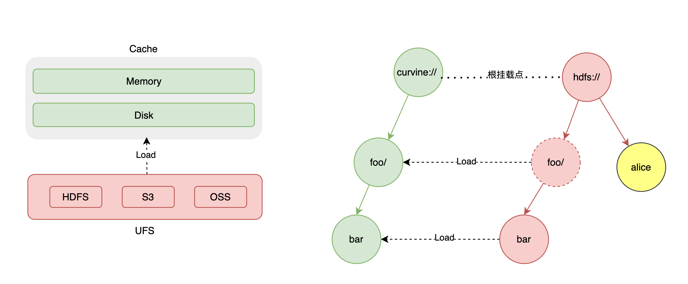

# 数据编排
Curvine 提供 UFS（统一文件系统）视图来管理所有支持分布式存储系统，包括 s3/hdfs 等。

## 挂载
Curvine 支持通过挂载到不同的 Curvine 路径来连接多个 UFS 源。Curvine 不提供默认的 UFS 配置，这意味着如果您要从 UFS 加载数据，必须先挂载 UFS 源。




Curvine 将挂载表持久化到元数据中，因此 Curvine 重启时无需重新挂载。但必须遵循一些规则。
- 不允许挂载到根路径。
- 挂载路径下不允许挂载其他 UFS。
- 相同的挂载路径不能挂载到不同的 UFS。

挂载命令：
```bash
bin/cv mount ufs_path curvine_path [configs]
```

- ufs_path：UFS 路径，例如 s3://bucket/path。
- curvine_path：Curvine 路径，例如 /ufs/path。
- configs：可选参数，例如 access_key_id、secret_access_key、region、endpoint 等。

示例：
```
bin/cv mount s3://ai/xuen-test /s3 \
-c s3.endpoint_url=http://hostname.com \
-c s3.region_name=cn \
-c s3.credentials.access=access_key \
-c s3.credentials.secret=secret_key \
-c s3.path_style=true
```

:::tip
您可以在 UFS 挂载后使用 命令行、API 访问 ufs 目录、文件，但除非您加载特定路径，否则 ufs 数据不会自动同步到 curvine。
:::

## 统一访问
UFS 挂载后，Curvine 提供了一个统一的文件系统视图，您可以像访问 Curvine 文件系统一样访问 UFS 文件系统；
客户端、命令行工具、fuse等都可以通过统一的路径访问 UFS 文件系统。

:::tip
Curvine 不换缓存 UFS 元数据，因此不存在访问数据一致性问题。从 Curvine访问 UFS 和直接访问 UFS 没有区别。
:::

## 关闭统一访问
如果您不想使用统一访问，可以添加、修改如下配置：
```
[client]
enable_unified_fs = false
```

